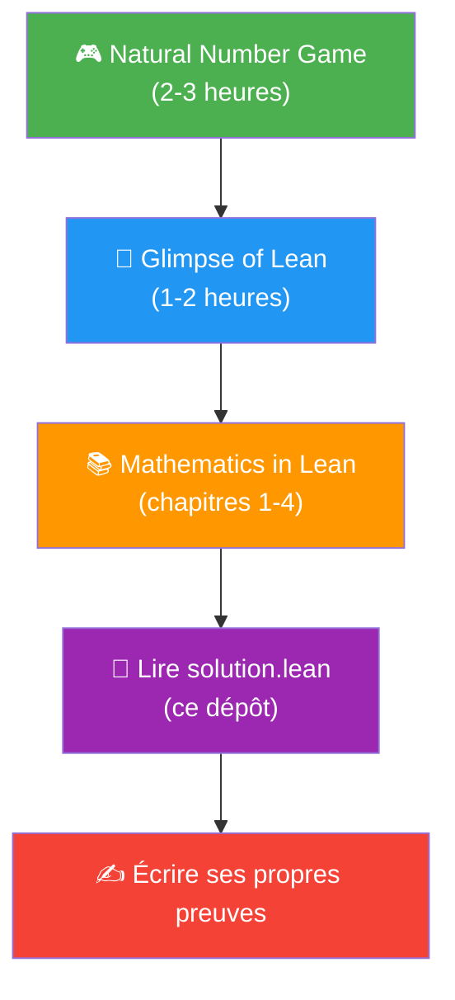

# Introduction au langage Lean 4

## Qu'est-ce que Lean 4 ?

**Lean 4** est à la fois un **langage de programmation fonctionnelle** et un **assistant de preuves** (*proof assistant*) développé par Leonardo de Moura (Microsoft Research, puis Lean FRO). Il permet de :

- **Formaliser des mathématiques** : écrire des définitions, des énoncés et des preuves vérifiées par ordinateur
- **Vérifier rigoureusement** : chaque étape de preuve est contrôlée par le noyau du compilateur — aucune erreur possible
- **Programmer** : Lean 4 est aussi un vrai langage de programmation performant

> [!IMPORTANT]
> Lean 4 est le successeur de Lean 3. Les deux versions sont **incompatibles**. Assurez-vous de toujours utiliser des ressources pour **Lean 4**.

### Pourquoi apprendre Lean ?

| Raison | Détail |
|--------|--------|
| **Rigueur absolue** | Contrairement à une preuve sur papier, une preuve Lean est vérifiée mécaniquement — pas d'erreur humaine |
| **Communauté active** | Le projet [Mathlib](https://leanprover-community.github.io/) contient >200 000 théorèmes formalisés |
| **Utilisé en recherche** | Le projet dont est issu ce dépôt (`dead-ends`) utilise Lean + Mathlib pour formaliser un résultat de théorie des nombres |
| **IA et mathématiques** | Des projets comme AxiomMath et AlphaProof utilisent Lean pour la recherche en IA |

---

## Installation de Lean 4 sur Windows

### Prérequis

- **Antigravity** — votre éditeur de code (basé sur VS Code)
- **Git** — pour la gestion des dépendances
- **Extension Lean 4** — déjà installée dans Antigravity

### Étape 1 : Installer Git

Si Git n'est pas déjà installé :

```powershell
winget install --id Git.Git --accept-source-agreements --accept-package-agreements
```

Puis configurez les fins de ligne (important sous Windows) :

```powershell
git config --global core.autocrlf input
```

### Étape 2 : Installer Lean via Elan

L'extension Lean 4 (déjà installée dans Antigravity) va vous guider. Deux méthodes :

**Méthode A (la plus simple)** : Créez un fichier `test.lean` dans votre projet — l'extension `.lean` suffit à activer l'extension. Si Lean n'est pas encore installé, un bouton **"Install Lean using Elan"** apparaîtra automatiquement. Cliquez dessus.

**Méthode B (via la palette de commandes)** :

1. Ouvrez la palette de commandes avec `Ctrl+Shift+P`
2. Tapez `Lean 4: Setup: Show Setup Guide`
3. Suivez les instructions affichées

Dans les deux cas, cela installe automatiquement :

- **elan** : le gestionnaire de versions Lean (comme `rustup` pour Rust)
- **lake** : le système de build et gestionnaire de paquets
- **lean** : le compilateur et vérificateur de preuves

### Étape 3 : Vérifier l'installation

Créez un fichier `test.lean` et écrivez :

```lean
#eval Lean.versionString
```

Si l'installation est correcte, le panneau **Lean Infoview** (à droite dans Antigravity) affichera la version installée (ex: `"4.26.0"`).

### Étape 4 : Ouvrir le projet dead-ends

```powershell
cd c:\Users\s.jaubert\projets\Maths\dead-ends
lake build
```

> [!WARNING]
> La première compilation avec Mathlib peut prendre **plusieurs heures** car elle télécharge et compile toute la bibliothèque (~200 000+ théorèmes). Soyez patient !

---

## Premiers pas en Lean 4

### 1. Les types de base

```lean
-- Nombres naturels
#check (42 : ℕ)        -- ℕ = nombres naturels (0, 1, 2, ...)
#check (42 : ℤ)        -- ℤ = entiers relatifs
#check (3.14 : ℝ)      -- ℝ = nombres réels (avec Mathlib)
#check (true : Bool)   -- Booléens

-- Propositions (types de preuves)
#check (2 + 2 = 4)     -- une Prop (proposition)
#check (∀ n : ℕ, n + 0 = n)  -- quantificateur universel
```

### 2. Définitions et fonctions

```lean
-- Définir une valeur
def monNombre : ℕ := 42

-- Définir une fonction
def double (n : ℕ) : ℕ := 2 * n

-- Évaluer une expression
#eval double 21  -- affiche 42
```

### 3. Écrire une preuve simple

```lean
-- Théorème : pour tout n, n + 0 = n
theorem add_zero (n : ℕ) : n + 0 = n := by
  rfl  -- "réflexivité" : les deux côtés sont identiques par définition
```

### 4. Les tactiques essentielles

Les **tactiques** sont les commandes utilisées dans les preuves (après `by`) :

| Tactique | Rôle | Exemple |
|----------|------|---------|
| `rfl` | Prouve `a = a` (réflexivité) | `theorem : 2 + 2 = 4 := by rfl` |
| `intro` | Introduit une hypothèse | `intro n` pour `∀ n, ...` |
| `apply` | Applique un lemme/théorème | `apply Nat.add_comm` |
| `exact` | Fournit le terme de preuve exact | `exact h` |
| `rw` | Réécrit avec une égalité | `rw [h]` remplace selon `h` |
| `simp` | Simplification automatique | `simp` essaie de simplifier |
| `ring` | Prouve les égalités algébriques | `ring` pour `a * b = b * a` |
| `linarith` | Arithmétique linéaire | `linarith` déduit des inégalités |
| `omega` | Arithmétique sur ℕ/ℤ | `omega` pour `n + 1 > 0` |
| `have` | Introduit un fait intermédiaire | `have h : P := ...` |
| `calc` | Preuve par chaîne d'égalités | Style calculatoire |
| `sorry` | Admet sans preuve (⚠️) | Pour prototyper |

### 5. Exemple commenté tiré de `solution.lean`

Voici un extrait simplifié et commenté du fichier `solution.lean` de ce dépôt :

```lean
-- Importer toute la bibliothèque Mathlib
import Mathlib

-- Définition : N est un "dead end" en base b si
-- 1. N > 0
-- 2. N est sans facteur carré
-- 3. Pour tout chiffre d dans {0, ..., b-1}, bN+d N'EST PAS sans facteur carré
def IsBaseBDeadEnd (b : ℕ) (N : ℕ) : Prop :=
  0 < N ∧ Squarefree N ∧ ∀ d ∈ Finset.range b, ¬Squarefree (b * N + d)
  --  ↑       ↑                    ↑                      ↑
  -- "ET"   "N sf"         "pour tout d"        "bN+d n'est pas sf"

-- Lean peut vérifier automatiquement si un nombre est un dead end
-- grâce à cette instance Decidable
instance (b N : ℕ) : Decidable (IsBaseBDeadEnd b N) := by
  unfold IsBaseBDeadEnd  -- déplie la définition
  infer_instance         -- Lean déduit automatiquement la décidabilité
```

### 6. Le mode interactif

La grande force de Lean 4 est son **mode interactif** dans Antigravity :

- Placez votre curseur sur une ligne de preuve
- Le panneau **Lean Infoview** affiche :
  - Les **hypothèses** disponibles (au-dessus de la barre `⊢`)
  - Le **but** à prouver (sous la barre `⊢`)
- Chaque tactique modifie le but, et vous voyez le résultat en temps réel

```
Exemple d'affichage Lean Infoview :

n : ℕ
h : n > 0
⊢ n + 1 > 1        ← c'est le but à prouver
```

---

## Ressources pour aller plus loin

### Tutoriels interactifs (recommandé pour débuter)

| Ressource | Lien | Description |
|-----------|------|-------------|
| **Natural Number Game** | [adam.math.hhu.de](https://adam.math.hhu.de/#/g/leanprover-community/NNG4) | Apprendre Lean en reconstruisant les nombres naturels (gamifié, idéal pour débuter) |
| **Glimpse of Lean** | [github.io](https://leanprover-community.github.io/glimpse_of_lean/) | 4 fichiers de base + exercices d'analyse, topologie, logique |
| **Lean Game Server** | [adam.math.hhu.de](https://adam.math.hhu.de/) | Plusieurs jeux interactifs (logique, ensembles, etc.) |

### Livres et manuels

| Ressource | Lien | Public |
|-----------|------|--------|
| **Mathematics in Lean** | [leanprover-community.github.io/mathematics_in_lean](https://leanprover-community.github.io/mathematics_in_lean/) | Mathématiciens souhaitant formaliser |
| **Theorem Proving in Lean 4** | [lean-lang.org/theorem_proving_in_lean4](https://lean-lang.org/theorem_proving_in_lean4/) | Référence complète sur les preuves |
| **Functional Programming in Lean** | [lean-lang.org/functional_programming_in_lean](https://lean-lang.org/functional_programming_in_lean/) | Lean comme langage de programmation |
| **An Introduction to Lean 4** (UV) | [www.uv.es](https://www.uv.es/mbrMDGA/lean4/) | Manuel complet, mis à jour en 2025 |

### Communauté

- **Zulip Chat** : [leanprover.zulipchat.com](https://leanprover.zulipchat.com/) — le forum principal, très actif et accueillant
- **Mathlib Documentation** : [leanprover-community.github.io/mathlib4_docs](https://leanprover-community.github.io/mathlib4_docs/) — documentation de la bibliothèque mathématique
- **GitHub Lean 4** : [github.com/leanprover/lean4](https://github.com/leanprover/lean4)

---

## Parcours d'apprentissage suggéré



1. **Semaine 1** : Jouer au [Natural Number Game](https://adam.math.hhu.de/#/g/leanprover-community/NNG4) — introduction ludique aux preuves
2. **Semaine 2** : Parcourir [Glimpse of Lean](https://leanprover-community.github.io/glimpse_of_lean/) — premiers fichiers `.lean`
3. **Semaines 3-4** : Lire les 4 premiers chapitres de [Mathematics in Lean](https://leanprover-community.github.io/mathematics_in_lean/)
4. **Ensuite** : Explorer le fichier `solution.lean` de ce dépôt pour voir un exemple réel de preuve formelle
5. **Pratique** : Formaliser ses propres théorèmes !

> [!TIP]
> Le **Natural Number Game** est de loin la meilleure porte d'entrée. Il ne nécessite aucune installation et se joue directement dans le navigateur.
